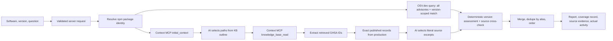

# AI Security Advisory Assistant

For the complete GitHub, credentials, architecture, and later hosting walkthrough, see [docs/GITHUB_SETUP.md](docs/GITHUB_SETUP.md).

Source-grounded security research using Next.js, Vercel AI SDK, and Sanity Context in **Knowledge Base mode**, with live advisory lookup against OSV.dev.

The application answers from two sources and always says which one a finding came from:

- **Live advisory lookup (OSV.dev)** — queried per request for the exact npm package and version. This is what gives the app coverage beyond the curated import, and it runs without waiting for any Knowledge Base rebuild.
- **Curated Sanity Knowledge Base** — reviewed advisory records and explanations, retrieved through Sanity Context MCP.

Neither source is treated as complete. Every report states which sources were checked, whether each completed, and that no match is not proof of safety.

This repository uses your existing **AI Security Advisory Assistant** project, ID **o7qa6o3y**, and existing **production** dataset. No project or dataset creation is implemented or required. Work directory: `/home/romil/ai-security-advisory-assistant` in WSL.

## Run locally in WSL

Requires Node 22.12+ (developed with Node 24). From WSL:

```bash
cd /home/romil/ai-security-advisory-assistant
npm ci
# .env.local already exists locally with the public project ID and empty secret fields.
# On a fresh checkout:
cp -n .env.example .env.local
npm run dev
```

Open http://localhost:3000. Without credentials, the real UI shows a configuration state and research returns a configuration error. There are no fixture responses or fake connection successes in the app.

## Complete authenticated setup

1. Open your **existing project** in [Sanity Manage](https://www.sanity.io/manage/personal/project/o7qa6o3y). Do not run `sanity init` or create a dataset.
2. In the **project's API → Tokens**, create a Viewer token for `SANITY_READ_TOKEN`. Create a separate Editor token for local ingestion as `SANITY_WRITE_TOKEN`. The write token belongs only on the importing machine.
3. At the **organization level**, enable Context in **Manage → Labs** if needed. Under the organization's **API → Tokens**, create a **Context Viewer** token for `SANITY_ORGANIZATION_TOKEN`. A project-level token does not authenticate Context MCP. Organization ID shown in your screenshot: `oaewu6zvh`.
4. Set `AI_PROVIDER` to `openai`, `anthropic`, or `nvidia`, `AI_PROVIDER_API_KEY`, and `AI_MODEL` to an available model with structured-output support. No model is hardcoded. For NVIDIA set AI_BASE_URL=https://integrate.api.nvidia.com/v1 and use a model ID currently listed in your NVIDIA catalog. NVIDIA uses Chat Completions; OpenAI retains its Responses path. `AI_BASE_URL` is optional for an operator-configured OpenAI-compatible provider.
5. Fetch and validate the initial collection:
   ```bash
   npm run ingest
   # Review data/import.ndjson, data/raw/, and data/ingestion-report.json.
   npm run ingest -- --apply
   ```
   The first command does **not** write to Sanity. The second writes only advisory documents into the existing production dataset. Existing unrelated documents are untouched.
6. Run `npx sanity login`, then `npm run schema:deploy`. Run `npm run studio` for local review at http://localhost:3333. Add that Studio origin to the existing project's CORS settings if prompted. The Studio configuration already selects o7qa6o3y / production.
7. In **Sanity Dashboard → Context**, create a **Knowledge Base** named *Security Advisory Knowledge Base*. This is an index inside your existing organization, not another project or dataset. Suggested purpose:
   > Help developers assess documented Next.js and Vite vulnerabilities, affected version ranges, deployment conditions, fixes, and uncertainty from original advisories.
8. Add a **Dataset** source pointing to project **o7qa6o3y**, dataset **production**, scoped to published `securityAdvisory` documents. Use the filter `_type == "securityAdvisory" && !(_id in path("drafts.**"))` if the source configuration offers a filter.
9. Add the Knowledge Base instructions from [docs/knowledge-base-instructions.md](docs/knowledge-base-instructions.md). Click **Build entries**. Wait for **Entries up to date**, inspect entries, and resolve important conflicts under **Issues**. Verify that each entry retains GHSA IDs, CVEs, exact version ranges, original URLs, dates, and conditions.
10. Create a dedicated MCP in the Context app. Add **only the Knowledge Base** as its source. Mixing a dataset source into this MCP switches it to GROQ mode. Copy its actual displayed endpoint URL into `SANITY_CONTEXT_MCP_URL`; do not construct or guess the endpoint name. Its documented shape is `https://api.sanity.io/v1/context/organizations/{organizationId}/mcp/{endpointName}`.
11. Restart the Next.js server. In the UI, “Connections configured” means environment validation passed, not a successful network test.
12. Run the opted-in integration scenario:
    ```bash
    RUN_LIVE_TESTS=1 npm run test:live
    ```
    This uses your real model and actual Sanity endpoint, costs model tokens, and writes `live-verification.json` only after successful assertions. Until this passes, do not claim live Sanity integration is verified.

Keep tokens in the ignored `.env.local` file or your hosting provider's secret store. Never use NEXT_PUBLIC variables for secrets or place credentials in prompts. The public project ID is safe to commit.

## Research data flow



The two paths are independent. If the model provider or the Context endpoint is unavailable, the live lookup still returns results and the report records the Knowledge Base source as failed. Fabricated or misattributed evidence remains fatal and aborts the request; only availability failures degrade.

Knowledge Base retrieval is mandatory. There is no runtime JSON-fixture, search-engine, or direct-model fallback. The supplementary Content Lake query is fixed and parameterized: it reads only published securityAdvisory records whose GHSA identifiers occurred in the retrieved Knowledge Base text. It is used for exact version boundaries and current source metadata, not discovery. A missing KB ID, empty retrieval, unknown product, unsupported range, or unverified excerpt cannot become a fabricated finding.

The model performs relevance selection and extractive synthesis. Impact and remediation excerpts are checked as literal substrings of the source description. Summary counts and version outcomes are computed by code. This deliberately limits paraphrasing; source text remains inspectable and quotes are not claimed to be independently verified facts.

## Initial advisory collection and ingestion

Four genuine advisories across two npm products, fetched from GitHub's public Global Security Advisories REST API:

| Product | Advisory | Original source |
| --- | --- | --- |
| Next.js | GHSA-f82v-jwr5-mffw / CVE-2025-29927 | https://github.com/vercel/next.js/security/advisories/GHSA-f82v-jwr5-mffw |
| Next.js | GHSA-gp8f-8m3g-qvj9 / CVE-2024-46982 | https://github.com/vercel/next.js/security/advisories/GHSA-gp8f-8m3g-qvj9 |
| Vite | GHSA-x574-m823-4x7w / CVE-2025-30208 | https://github.com/vitejs/vite/security/advisories/GHSA-x574-m823-4x7w |
| Vite | GHSA-xcj6-pq6g-qj4x | https://github.com/vitejs/vite/security/advisories/GHSA-xcj6-pq6g-qj4x |

These four are the seed of the curated collection, not all current advisories for either product. The curated list now lives in **`data/advisory-sources.json`**, generated from the seed on first run, so advisories can be added without code changes:

```bash
npm run ingest                                  # dry run over the configured list
npm run ingest -- --apply                       # write to the existing production dataset
npm run ingest -- --only next                   # refresh one package or one GHSA id
npm run ingest -- --discover axios --limit 5    # add advisory ids for a package to the list
```

`--discover` queries OSV for the package, takes the most recently modified reviewed GHSA advisories up to `--limit` (default 10, maximum 50), and adds any that are not already listed. It is idempotent, explicit, and bounded: it runs only when you invoke it, never on a schedule, and it adds identifiers to the list without importing anything by itself. Nothing is written to Sanity without `--apply`.

GitHub responses are cached with their ETag in `data/raw/<id>.meta.json` and re-requested conditionally, so an unchanged advisory returns `304` and spends no rate limit. Rate-limit responses abort the run before anything is written.

The report at `data/ingestion-report.json` ends with an explicit **`knowledgeBase.rebuildRequired`** flag: it is true only when document content actually changed in production, and the run then prints an action line telling you to rebuild the Knowledge Base in the Sanity Dashboard. There is still no automatic refresh scheduler.

The importer validates the complete batch before a transaction. It preserves original descriptions, API URLs, publication/update/fetch timestamps, references (including original HTTP reference links), branch-specific ranges/fixes, withdrawal status, and SHA-256 hashes of source JSON. GitHub API severity “medium” maps to the display taxonomy “moderate”; missing values remain null.

Stable document IDs prevent duplicates. Older source revisions are skipped. Unchanged content updates only fetchedAt, preserving editorial review. Changed source content resets conditionsReviewed and condition/exploitation/remediation annotations; re-review these against the updated source. Revision guards reject concurrent changes rather than silently overwriting them. No deletion or create-project operation exists.

Review deployment conditions in Studio before enabling conditionsReviewed. Null conditions mean unreviewed. An explicit empty array with conditionsReviewed=true means a reviewer established no additional conditions. Do not mark a deployment unaffected from a prose guess. Explicit unaffected ranges need an original-source statement. Re-run ingestion and rebuild/review the KB after updates; there is no automatic refresh scheduler.

## Live advisory lookup

**Source: [OSV.dev](https://osv.dev), `https://api.osv.dev`.** Chosen because it is public, needs no API key, aggregates the GitHub Advisory Database among others, and exposes exact package/version queries plus a batch endpoint suitable for lockfiles.

**Documented coverage and limits.** OSV aggregates many databases (GitHub, PyPI, Go, crates.io, Debian, Ubuntu and more). **This application queries the npm ecosystem only.** Anything outside npm is reported as unsupported rather than answered. OSV is not a complete record of all vulnerabilities in existence, and an advisory can be unpublished, embargoed, misattributed or simply absent.

How a request works:

1. **Identity resolution.** A display name is mapped to an exact npm package (`Next.js` → `next`) through an explicit alias table; an exact package name is accepted as typed. A name that maps to more than one package (for example `Angular`) stops and asks which one you mean instead of guessing. A name that is neither is reported as unsupported.
2. **Two queries.** One for every advisory OSV holds for the package, one scoped to the supplied version. Paging is bounded and truncation is reported; the request is retried once for transient errors only.
3. **Normalisation.** OSV `introduced`/`fixed`/`last_affected` events become explicit intervals (`>=14.0.0 <14.2.25`). `last_affected` is inclusive and yields no fixed version. OSV publishes CVSS **vectors**, not scores, so a numeric score is never derived — the vector is shown as published.
4. **Deterministic assessment.** Version applicability is computed in application code, then cross-checked against OSV's own version matcher. Disagreement is reported as a conflict rather than resolved. When the published ranges are not comparable semver, that is stated and the source's verdict is reported as the only evidence.
5. **Alias de-duplication.** Records sharing an identifier are merged, but only when their version ranges agree; sources that disagree about ranges are kept separate.

Live records are **unreviewed source data**. They can never reach *Confirmed affected*, because `conditionsReviewed` is false by construction. Results are cached in-process for 10 minutes; a cached read is labelled `Cached` with the time it was actually fetched, and truncated result sets are never cached.

Only `https://api.osv.dev` is contacted, as a compile-time constant. No model output, advisory field, or user input can direct a request anywhere else.

## Coverage reporting

Every report carries a `coverage` record, shown in the **Coverage** tab:

- the resolved package and ecosystem, and how the name was resolved
- each source checked, whether it completed, partially completed, failed or was skipped, with the reason
- per-source duration and whether results were **Live**, **Cached** or a **Built snapshot**
- how many advisories were retrieved, how many the source matched to the version, and the newest source record
- an explicit incomplete state whenever any source did not fully complete

A report is marked complete only when every source completed. A skipped source counts as reduced coverage. Findings are labelled `Curated Knowledge Base`, `Live source lookup`, or `Curated + live source`.

## Dependency file analysis

`POST /api/dependencies` accepts a `package-lock.json` (also available in the **Dependencies** tab).

- Lockfile v1, v2 and v3 are parsed **as data**. Install scripts and lifecycle hooks are never read or executed, and no path from the file touches the filesystem.
- Direct and transitive dependencies are extracted with their exact installed versions; dev dependencies are flagged.
- Entries without an exact published version — workspace links, git and file dependencies — are skipped and counted rather than guessed.
- Versions are queried in bounded batches of 100. Full advisory records are fetched for the 25 most-affected packages; other affected packages list advisory identifiers only, and the report says so.
- A failed lookup is never rendered as a clean dependency tree.

This checks **known advisories for the exact versions in your lockfile**. It does not analyse your code, your configuration, or whether a vulnerable code path is reachable.

## Colour system

Colour is semantic here, not decoration. Every hue is defined once as a token on `:root` and applied through a single `--accent` custom property, so a status owns a colour rather than a rule owning a hex value.

| Meaning | Colour |
| --- | --- |
| Severity | critical `#ff4d6d`, high `#ff8c42`, moderate `#ffd166`, low `#4cc9f0` |
| Assessment | affected rose, conditional amber, conflict violet, unaffected green, outside-range slate, unknown grey |
| Source check | completed green, partial amber, did not complete rose, not run slate |
| Provenance | curated cyan, live violet, corroborated by both green |
| Section | research violet, coverage cyan, dependencies amber, sources rose, activity green |

Two rules this enforces:

- **A label and its colour come from the same field.** The provenance badge derives its colour class from `finding.origin`, the same value that produces its text, so a finding can never read "Curated Knowledge Base" while being styled as a live-source result. A browser test asserts this.
- **Every status is visually distinct.** Before this change six assessment statuses shared two treatments, so "Conflicting evidence", "Outside listed range" and "Insufficient evidence" looked identical. All six now have their own colour.

Contrast was measured in the browser against the composited background rather than estimated. Every sampled foreground/background pair meets **WCAG AA (4.5:1)**, with a measured minimum of **5.73:1**.

Surfaces use `color-mix(in srgb, var(--accent) N%, transparent)` for tints and borders, so a hue change propagates everywhere automatically.

## Typography

Inter and JetBrains Mono are loaded through `next/font`, which downloads and **self-hosts them at build time**, so the running page makes no request to a third-party font host. Both are variable fonts. The headline runs at `clamp(38px, 6.2vw, 86px)`, sized against measured practice in the GSAP showcase (median display heading: 90px). `.welcome h1` reserves the hero symbol's footprint with `max-width: calc(100% - 190px)`; without it the headline collapses to one line between roughly 1450px and 1600px and overlaps the graphic, a band that falls between the desktop and mobile test viewports. See [docs/GSAP-SHOWCASE-RESEARCH.md](docs/GSAP-SHOWCASE-RESEARCH.md).

## Interface motion (GSAP)

Animation uses **GSAP 3** with **@gsap/react**. Both come from the public `gsap` npm package; every plugin is free, including commercial use, following Webflow's acquisition of GSAP. No Club membership, `.npmrc`, auth token, or private registry is involved.

All motion lives in [src/components/dashboard-motion.ts](src/components/dashboard-motion.ts), so the dashboard component stays about data rather than animation.

- **`useGSAP()` with a `scope`** — every selector is scoped to the dashboard root, and cleanup (reverting tweens and ScrollTriggers) runs automatically on unmount. Report and dependency sequences pass `revertOnUpdate` so a new result re-runs its own entrance cleanly.
- **`gsap.matchMedia()` with an always-matching `base: 'all'` condition alongside `(prefers-reduced-motion: reduce)`.** Registering only the `reduce` query would run the handler *solely* for people who asked for reduced motion and for nobody else — a bug this project hit and now tests against. Reduced motion — animated durations collapse to `0` and the scroll reveals are skipped entirely, so nothing is ever left faded out for a user who asked for reduced motion. CSS hover and spinner animations are disabled under the same query.
- **Transforms and opacity only** — `x`, `y`, `scale`, `rotate`, `opacity`. No `width`, `height`, `top` or `left` is animated, so the work stays off the layout path. `will-change` is set only on elements that actually animate.
- **ScrollTrigger** reveals the below-the-fold panels once (`once: true`, `start: "top 92%"`), with no pinning or scrubbing.
- **Staggers instead of manual delays**, and a single timeline for the page entrance rather than chained `delay` values.
- **SplitText line reveal** on the headline with `autoSplit`, so the split re-runs when the variable font swaps in. Under reduced motion the headline is never split at all.

What is animated: the shell and hero on first paint; the example cards, results panel and footer on scroll; findings, the coverage strip and limitations when a report arrives; dependency rows when a lockfile is checked; the newest activity row as it streams; a crossfade on tab change; and a breathing pulse on the status light while a request is running.

Hover and press feedback stays in CSS, where a transition is cheaper than a tween.

## Version and evidence policy

- Stable npm semver is evaluated automatically for any npm package; npm publishes semver, so the comparison is well defined. Other ecosystems are reported as unsupported rather than compared.
- Live records whose ranges are not expressed as comparable semver (for example mixed SEMVER/ECOSYSTEM ranges) are not compared; the source's own verdict is reported instead, and the limitation is stated.
- Live records are unreviewed and therefore cap at **Conditions to verify**.
- This application's verdict is cross-checked against the source's version matcher; a genuine disagreement is reported as **Conflicting evidence** and never silently resolved.
- A matching version with unreviewed or platform/configuration conditions is **Conditions to verify**.
- **Confirmed affected** requires a range match and reviewed absence of additional conditions.
- **Explicitly unaffected** requires a separate, explicit unaffected range.
- Outside a listed range is not a claim of safety.
- Prereleases, vendor suffixes, build metadata/backports, withdrawn advisories, missing ranges, and unsupported ecosystems yield uncertainty.
- Conflicting affected/unaffected ranges, differing records for the same CVE, or explicit retrieved conflicts are surfaced.
- Source fetches older than 30 days get a freshness warning. A source publication date alone is not evidence of stale intelligence.
- Listed fixes address a specific advisory/release branch, not all vulnerabilities in that release.
- Missing information displays “Not established by available sources.”

## Security and deployment

The research route accepts bounded, validated JSON; requests time out after 100 seconds. The MCP transport uses HTTPS at api.sanity.io, rejects redirects, and exposes only the two allowlisted read tools. Retrieved instructions cannot expand capabilities. The model receives no tokens, filesystem, execution tools, user-chosen URLs, or network scanning access. Excerpts are plain React text, not executable HTML or rendered untrusted Markdown. SDK clients close in finally blocks. Error responses never include upstream errors or credentials.

For a non-local deployment, set **APP_ORIGIN** to the exact public origin and **RESEARCH_ACCESS_TOKEN** to a strong random access code. The UI asks for this code; it is held only in component memory. Production research refuses to run without both settings. Share the code only with intended evaluators.

A process-local global budget allows 12 accepted requests per minute and at most 3 concurrent requests, independent of spoofable proxy headers. **Before a public multi-instance deployment, configure a shared rate limit at your hosting edge/WAF** and provider spending limits; process-local limits do not aggregate across instances. Use proper account authentication for a public multi-user service.

Deploy to a Node-compatible Next.js host such as Vercel:
1. Use the existing GitHub repository [romilp619/ai-security-advisory-assistant](https://github.com/romilp619/ai-security-advisory-assistant).
2. Import it as a Next.js project, Node 22+, install with npm ci, build with npm run build.
3. Set the runtime environment variables from .env.example. Omit SANITY_WRITE_TOKEN and GITHUB_TOKEN from the web deployment.
4. Set APP_ORIGIN, RESEARCH_ACCESS_TOKEN, an edge rate limit, and a function time budget of at least 120 seconds.
5. Run the live test and a browser request against the deployed application. No deployment URL is claimed here.

Studio is a separate local administration tool; it is not exposed by the Next.js app. Its project identifier is public. No remote schema, Studio, or application deployment occurs automatically.

## Verification

```bash
npm run typecheck
npm run lint
npm test
npm run build
npx sanity build
npx playwright install chromium
npm run test:e2e
RUN_LIVE_TESTS=1 npm run test:live
```

Live paths can also be exercised directly against a running dev server:

```bash
curl -s -N -X POST http://127.0.0.1:3000/api/research -H 'Content-Type: application/json' -H 'Origin: http://localhost:3000' -d '{"software":"axios","version":"1.7.3","question":"Which documented advisories affect this version, and what are the listed fixed versions?"}'
```

```bash
curl -s -X POST http://127.0.0.1:3000/api/dependencies -H 'Content-Type: application/json' -H 'Origin: http://localhost:3000' --data-binary @package-lock.json
```

Unit tests use real downloaded advisory fixtures — including a captured OSV.dev response at `tests/fixtures/osv-npm-next.json` covering semver ranges, mixed range types, `last_affected` boundaries and enumerated versions — but mock the model, the Content Lake, and outbound HTTP. A local HTTP MCP server test uses the actual AI SDK MCP client to check initialization, authentication, discovery, reads, and closure. Browser tests cover desktop/mobile states and use an explicitly mocked research transport. None of those prove connectivity to your live Knowledge Base. See [VERIFICATION.md](VERIFICATION.md) for actual execution results.

The lockfile pins compatible ai@6 and @ai-sdk/mcp@1. Transitive overrides patch advisories in Sanity's development tooling; validate Studio build after changing them.

## Code map

- src/app: dashboard entry point and server routes
- src/components/dashboard.tsx: form, reports, coverage, dependencies, activity, setup dialog
- src/components/dashboard-motion.ts: GSAP entrance, scroll reveal and result timelines, reduced-motion aware
- src/lib/agent.ts: constrained research orchestration, source merging, coverage record
- src/lib/mcp.ts: HTTP MCP client and result validation
- src/lib/osv.ts: OSV.dev client — fixed host, paging, retry, batch
- src/lib/live-advisory.ts: OSV normalisation, range intervals, alias de-duplication, verbatim excerpts
- src/lib/live-lookup.ts: live lookup orchestration, caching, source cross-check, ordering
- src/lib/package-identity.ts: display name to exact npm package, with ambiguity handling
- src/lib/lockfile.ts, dependency-scan.ts: package-lock parsing and bounded batch scanning
- src/lib/advisory-cache.ts: short-lived in-process cache
- src/lib/logging.ts: redacted server-side diagnostics
- src/lib/schema.ts, versions.ts: data validation and version policy
- src/lib/ingestion.ts, source-list.ts, scripts/ingest.ts: verified, extensible import path
- sanity/: structured advisory model
- tests/: unit, local-wire MCP, browser, and opt-in live tests

## Official references consulted

- [Sanity Context tools](https://www.sanity.io/docs/ai/sanity-context-mcp-tools)
- [Create a Knowledge Base](https://www.sanity.io/docs/ai/sanity-context-create-knowledge-base)
- [Configure an MCP](https://www.sanity.io/docs/ai/sanity-context-configure-mcp)
- [Context security and token types](https://www.sanity.io/docs/ai/sanity-context-security)
- [Compatible Vercel AI SDK / MCP majors](https://www.sanity.io/docs/ai/sanity-context-quick-start)
- [AI SDK structured outputs](https://ai-sdk.dev/docs/reference/ai-sdk-core/output)
- [OSV API](https://google.github.io/osv.dev/api/) and [OSV schema](https://ossf.github.io/osv-schema/)
- [npm package-lock.json format](https://docs.npmjs.com/cli/v10/configuring-npm/package-lock-json)
- [GSAP React guide](https://gsap.com/resources/React) and [gsap.matchMedia()](https://gsap.com/docs/v3/GSAP/gsap.matchMedia/)

## NVIDIA model setup

The app also supports NVIDIA's hosted Chat Completions endpoint without an OpenAI API key. Use these values in the ignored .env.local file:

```dotenv
AI_PROVIDER=nvidia
AI_BASE_URL=https://integrate.api.nvidia.com/v1
AI_MODEL=nvidia/nemotron-3-super-120b-a12b
AI_PROVIDER_API_KEY=YOUR_NVIDIA_API_KEY
```

On 2026-09-24, Nemotron 3 Super passed all five checks in a small live model evaluation using a real advisory fixture and a synthetic KB outline. The checks covered relevant path selection, source attribution, literal excerpts, one embedded-instruction case, and abstention for an unsupported product. The successful run took 22.1 seconds over three requests. Earlier requests also encountered a 503 and path-title formatting errors; clarifying the path instruction resolved the formatting in the observed run.

This is the recommended starting model for this application among the tested endpoints, not a general cybersecurity ranking or an uptime guarantee. Free hosted endpoints are for prototyping/testing according to NVIDIA's documentation. The current Token Harbor configuration and Sanity Context retrieval passed the opt-in live test; see [VERIFICATION.md](VERIFICATION.md) for the observed run. This older NVIDIA comparison did not test Sanity retrieval.

See docs/NVIDIA-MODEL-CHECK.md and the machine-readable docs/nvidia-model-check.json. To repeat the small live check:
```bash
npm run check:nvidia -- nvidia/nemotron-3-super-120b-a12b
```

This uses the server-side key, sends public advisory fixture text to NVIDIA, and makes three model requests on a successful run. It does not import content, contact Sanity, or send other environment variables to the model.

## Token Harbor provider (2026-09-29)

The local app now uses the same free-model ID configured in OpenCode:

    AI_PROVIDER=token-harbor
    AI_BASE_URL=https://tokenharbor.ai/v1
    AI_MODEL=deepseek-v4.1-flash:free
    AI_PROVIDER_API_KEY=your_local_token_harbor_key

Keep the real key only in the ignored, permission-restricted .env.local. This configures this application; it does not change the coding assistant's own backend.

The adapter uses Token Harbor's Chat Completions API, rejects redirects and alternate gateway URLs, and supplies the requested JSON schema in the prompt as well as response_format. Live testing showed that the gateway/model could return JSON of the wrong shape when only response_format specified it. DeepSeek thinking is disabled for schema-constrained selection calls because reasoning consumed the entire 1800-token output budget in a measured Axios failure, leaving no JSON. SDK schema validation, exact path checks, and passage attribution checks still apply. OSV live lookup remains independent of the model.

Provider documentation: https://tokenharbor.ai/docs/api/curl
