# AI Security Advisory Assistant

A solo project by Romil Patel.

An evidence-first workspace for researching known vulnerabilities in npm packages. Ask about a package and version, or check a `package-lock.json`; the result links back to published advisories and shows what was actually checked.

**Status:** The source is on GitHub and the local app has passed a live integration test. A public web deployment has not been configured.

## Inspiration

A vulnerability answer is only useful if a developer can tell which package and version it applies to, where the claim came from, and what remains uncertain. Advisory data is spread across sources, while a fluent AI answer can blur version ranges or overlook deployment conditions. I built a workspace that keeps the evidence visible from question to conclusion.

## What It Does

- Researches a named npm package, an optional installed version, and a security question.
- Checks live advisories from OSV.dev and relevant entries in my Sanity Context Knowledge Base.
- Shows affected ranges, source-listed fixes, deployment conditions to verify, original links, and a record of completed or failed source checks.
- Accepts a `package-lock.json` by file picker or drag and drop, then checks exact direct and transitive dependency versions against published advisories.
- Reports uncertainty explicitly. No match is not presented as proof that software is safe.

The lockfile check reads JSON as data; it does not run install scripts or scan application code.

### Step-by-step screenshots

These screenshots show a **local** research session and the sample dependency-file check. The project has not been deployed to a public URL.

#### 1. Start a security research question

Open the Research page. Enter the software name and, if known, the installed version.

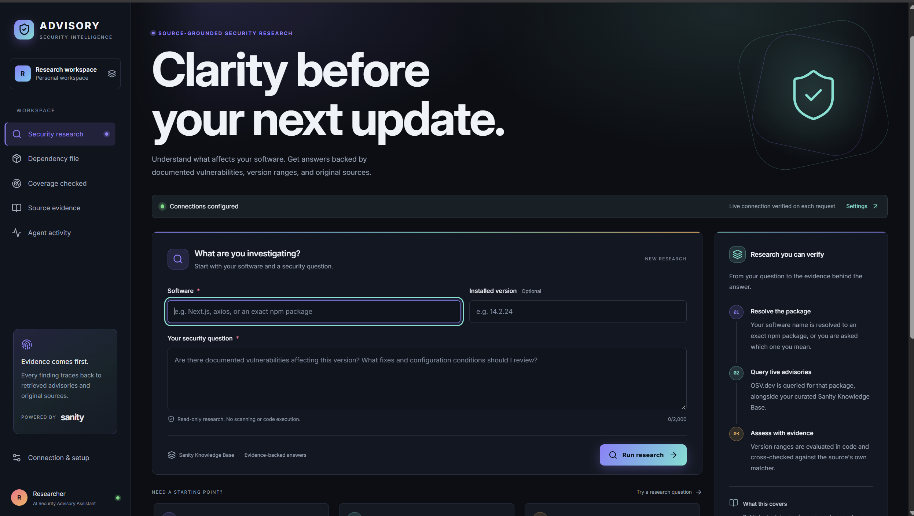

#### 2. Ask a specific, versioned question

For this example, enter **Next.js**, version **14.2.24**, and ask whether **CVE-2025-29927** applies, what fixes are listed, and which deployment conditions need review. Select **Run research**.

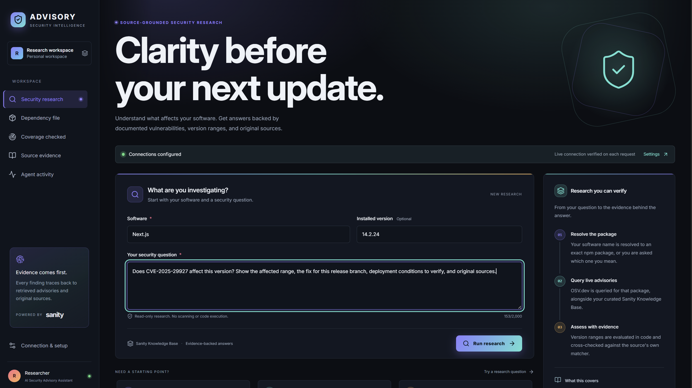

#### 3. Read the research overview

The overview shows the advisory findings, version assessment, affected ranges, and source-listed fixes. Open an original advisory link before acting on a result.

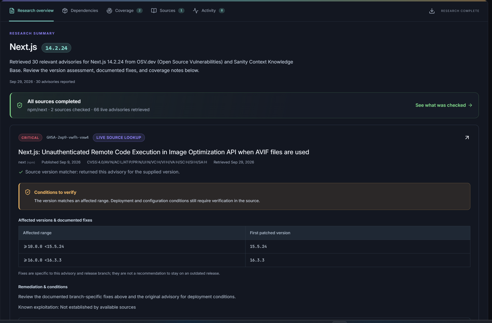

#### 4. Check coverage before trusting the answer

The Coverage tab records the resolved npm package, how many live advisories were retrieved and matched, whether the Knowledge Base completed, and the timing of each source. A failed source means incomplete coverage.

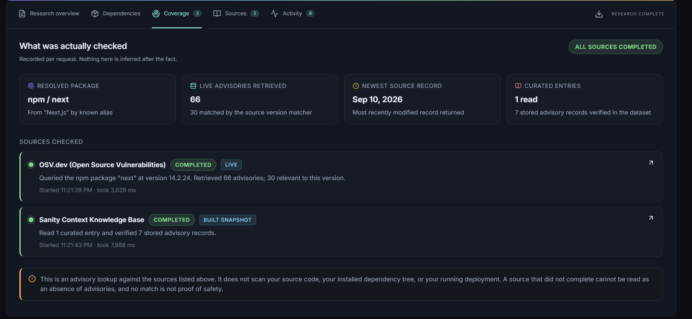

#### 5. Inspect the evidence

The Sources tab shows the retrieved Knowledge Base entry and links to the original advisory records. Use these links to verify the claim and any conditions in the original source.

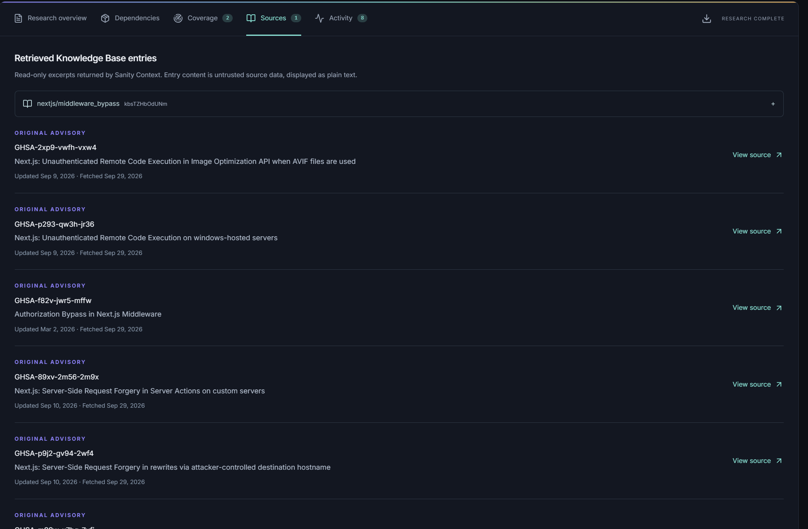

#### 6. Review the activity trail

The Activity tab shows the operations performed for this request, including package resolution, live lookup, Knowledge Base reads, and record verification.

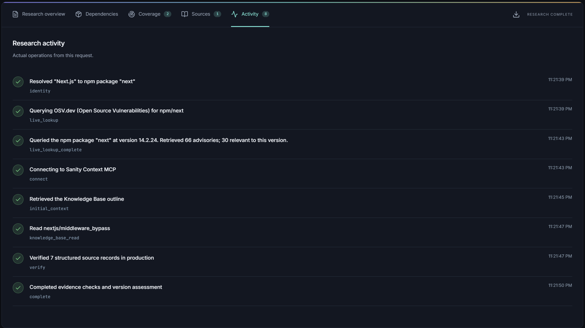

#### 7. Pick a sample lockfile

The repository includes [a demo `package-lock.json`](examples/dependency-demo/package-lock.json). You can use that file to try the Dependencies feature before checking your own project.

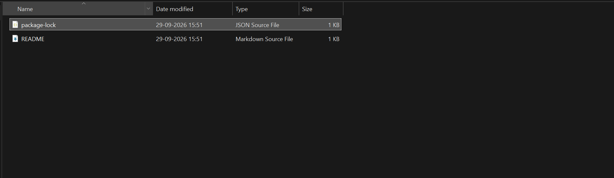

#### 8. Upload by choosing or dragging the file

Open **Dependencies** and choose the lockfile, or drag and drop it onto the upload area. The app parses the JSON as data; it does not install packages or run scripts.

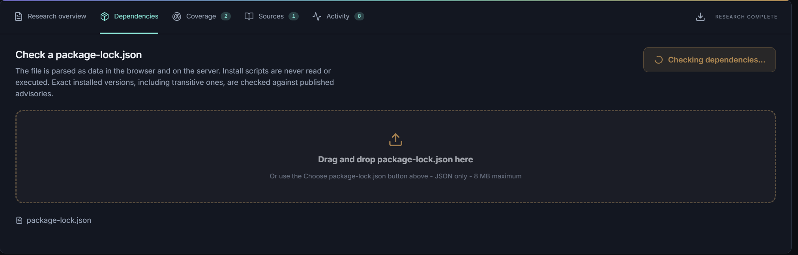

#### 9. Review exact dependency matches

The result groups matching source records by installed package and version. Follow each advisory link and check its listed fix and conditions. This is a known-advisory lookup, not a scan of your code or deployment.

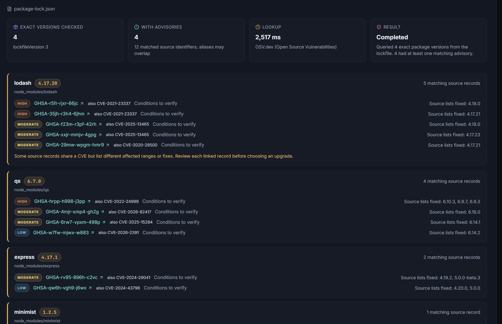

## Why It Is Defensible (and I Can Prove It)

The server reads the Knowledge Base through Sanity Context MCP, verifies referenced published advisory records in the existing Sanity dataset, and checks npm advisories live through OSV.dev. The model selects relevant paths and source passages; application code validates those selections and calculates version outcomes. A finding links to its original record, and the Coverage and Activity views show which real operations completed.

The app does not let retrieved text add tools or change the trusted endpoints. If a source fails, the report records the failure instead of presenting a complete-looking answer. Its version assessment can show **Conditions to verify**, **Conflicting evidence**, or **Outside listed range** rather than inventing certainty.

This behavior is testable: 129 offline tests and 26 browser tests passed in the latest recorded full run. An opted-in live test also exercised the model, Sanity Context, the existing production dataset, and a real Next.js advisory. See [the verification record](VERIFICATION.md) for dates and limits of those checks.

## How I Built It

### Architecture

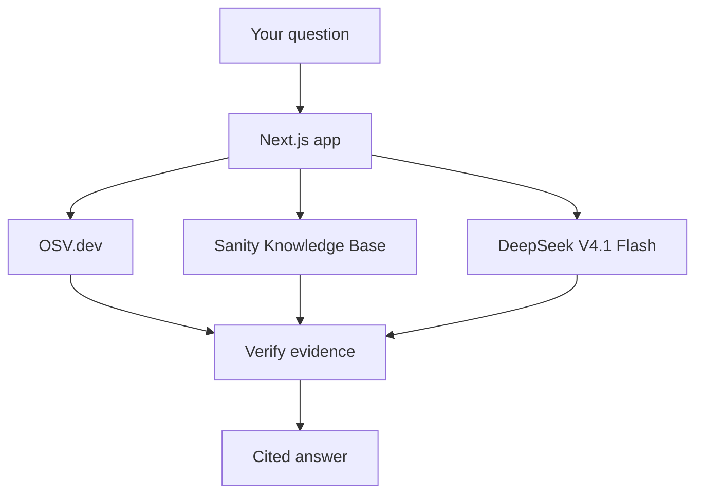

The app combines live advisory results with selected records from the Sanity Knowledge Base. DeepSeek V4.1 Flash, accessed through Token Harbor, helps select relevant evidence. Application code checks version ranges and cited records before showing the answer.

The **dependency-file check** follows a separate, simpler path: upload `package-lock.json` -> check exact package versions against OSV.dev -> show matches. It does not use the model or Knowledge Base. To expand the curated source, I import selected GitHub advisories into Sanity separately and rebuild the Knowledge Base.

I used my existing Sanity project **AI Security Advisory Assistant** and its existing **production** dataset. An importer collects selected original GitHub Security Advisories into structured records. Sanity Context builds navigable Knowledge Base entries over those records; the app uses the Knowledge Base for relevant context and checks exact records for version boundaries. Live OSV.dev lookup extends coverage beyond the curated collection without waiting for a Knowledge Base rebuild.

### How I use Sanity

These screenshots show my real Sanity setup. Account details, project and organization IDs, and trial information are obscured where visible. No tokens or MCP URL are shown.

1. **Keep the existing project and dataset.** I configured the app and local Sanity Studio for my existing AI Security Advisory Assistant project and its `production` dataset. I did not create a second project or dataset. The project settings screen is where I confirm which project is selected.

   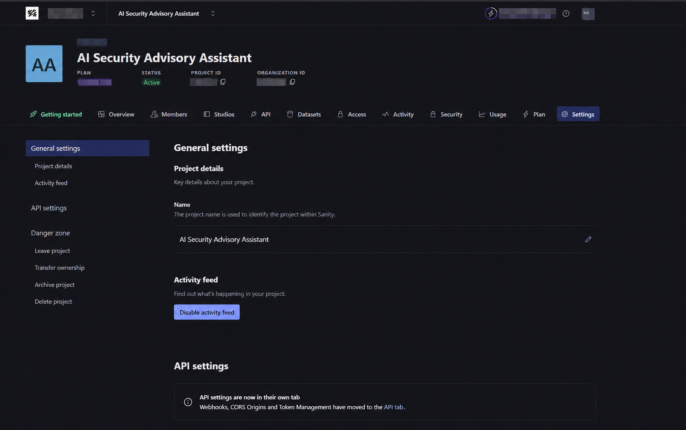

2. **Import selected source advisories.** `data/advisory-sources.json` lists original GitHub Security Advisories. `npm run ingest` fetches and validates them as a dry run; `npm run ingest -- --apply` writes the reviewed records into `production` using a project Editor token held only in the local environment. The current curated collection contains **122 published advisory documents**. The organization activity view records that I attached this dataset to the **Security Advisories** Knowledge Base and created the **Security Advisor** Context MCP endpoint.

   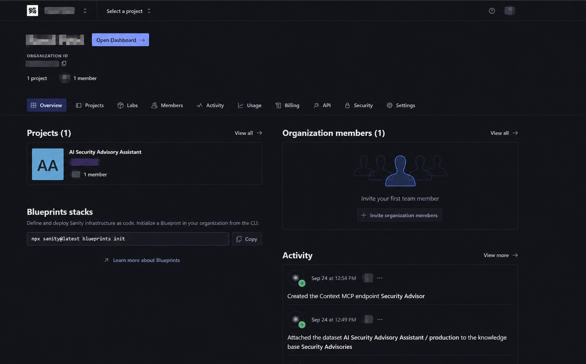

3. **Build a navigable Knowledge Base.** In Sanity Context, I selected the `production` dataset as the source and built its entries. This screen shows **122 source documents**, a **Ready** source, and **28 generated entries** at the time of capture. Documents are the stored advisories; entries are shorter, cited paths the agent can navigate. The counts are different because one entry can summarize multiple documents, and they can change after a rebuild.

   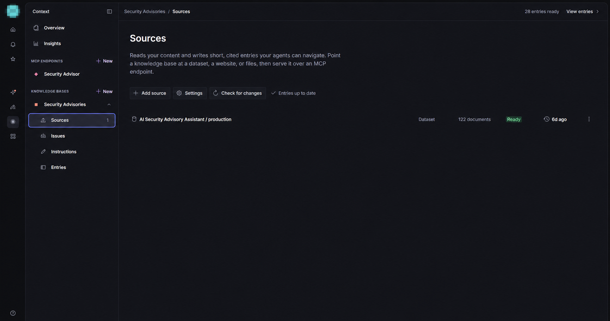

4. **Retrieve and verify at request time.** The Next.js server connects to the Security Advisor MCP endpoint with an organization Context Viewer token and calls `initial_context` and `knowledge_base_read`. It uses a separate project Viewer token to read the published advisory records behind cited entries. The model helps select paths and passages; application code checks that paths, quotes, source links, and version conclusions agree with the records. The server also queries OSV.dev for live npm advisories, so a package is not limited to the curated 122 documents.

5. **Refresh after imports.** When source records change, I rerun ingestion, rebuild the existing Knowledge Base, wait for **Entries up to date**, and run a live test and a browser query. The Context endpoint and organization token stay server-side. The local Editor token is only for importing, never for the public app.

6. **Inspect the generated evidence.** The Entries view groups advisories by package and topic. This Next.js page brings related cache-poisoning and XSS records together with affected ranges, fixes, conditions, and numbered source citations. The agent can navigate to a relevant entry through MCP instead of reading every source document.

   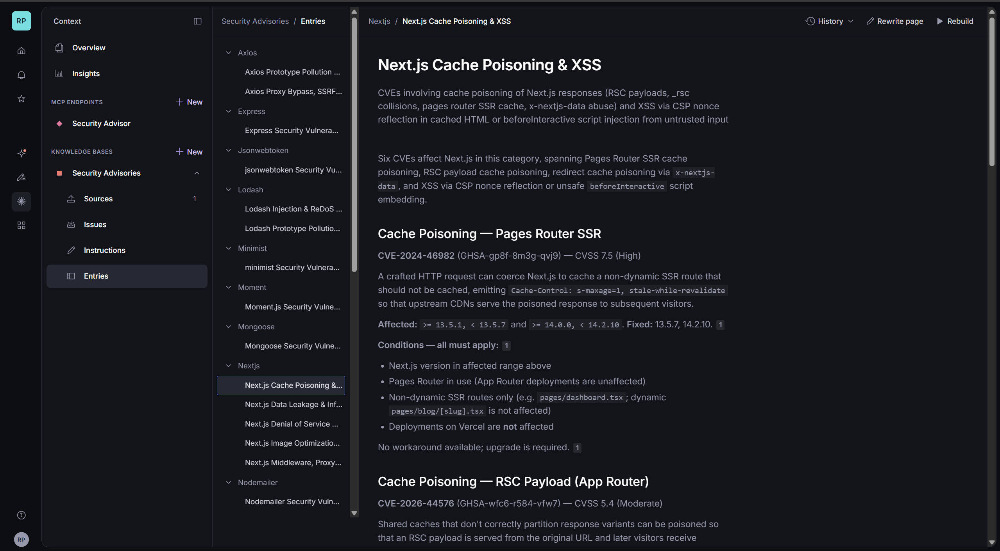

The [setup guide](docs/GITHUB_SETUP.md) explains where each credential belongs. A green **Ready** label on the Knowledge Base screen shows that its source was processed; the [live verification record](VERIFICATION.md) is the evidence that the app actually retrieved and checked it.

The current local model configuration uses Token Harbor's `deepseek-v4.1-flash:free`. Credentials stay server-side in an ignored local environment file or, later, a host's secret store.

## Challenges

- GitHub advisory records can share CVEs while listing different affected ranges or fixes. I preserve source-level differences instead of silently choosing one.
- Version matches do not establish whether a vulnerable feature or deployment condition is present. Those cases remain conditional until reviewed.
- Free model endpoints can be overloaded or return malformed structured output. The server validates model output and reports source failures.
- Curated Knowledge Base entries must be rebuilt after changed imports. The importer reports when a rebuild is required.

## Accomplishments

- Built a working research UI with source evidence, coverage, activity, and a drag-and-drop dependency-file check.
- Imported 122 advisory documents into the existing Sanity production dataset and connected the Knowledge Base through its MCP endpoint.
- Verified an end-to-end local research request against real Sanity and model services, including the documented Next.js 14.2.24 middleware advisory and its branch-specific fix.
- Published the source and reproducible setup instructions while keeping local API keys out of Git.

These are observed checks, not a claim that every vulnerability or deployment condition is covered.

## What's Next

Choose a Node-compatible host, configure server-side secrets and an access code, and run a hosted smoke test. Review more curated advisory conditions in Sanity Studio, rebuild the Knowledge Base when records change, and add shared rate limiting and account-based access before opening the app to broad public use.

## Built With

Next.js, React, TypeScript, Node.js, Sanity Content Lake, Sanity Context MCP, OSV.dev, GitHub Security Advisories, Vercel AI SDK, Token Harbor, Vitest, and Playwright.

For setup and architecture, start with [docs/GITHUB_SETUP.md](docs/GITHUB_SETUP.md). For the exact tests performed, see [VERIFICATION.md](VERIFICATION.md).
