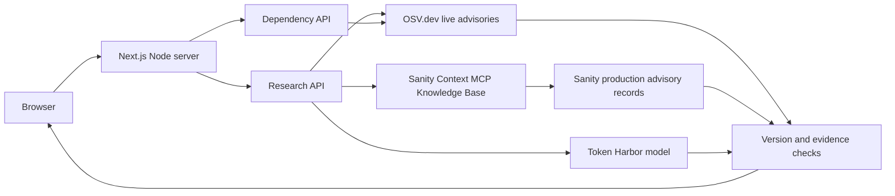

# GitHub setup and deployment guide

This is the source for [romilp619/ai-security-advisory-assistant](https://github.com/romilp619/ai-security-advisory-assistant). GitHub stores code; a Node-compatible host is still needed to run the Next.js API routes. Hosting will be chosen later.

Use the existing Sanity **AI Security Advisory Assistant** project (`<existing-project-id>`), organization (`<existing-organization-id>`), and **production** dataset. Do not create another project or dataset.

## How it works

The browser sends a software/version/question to `POST /api/research`, or a `package-lock.json` to `POST /api/dependencies`. The Next.js server queries OSV.dev for live npm advisories. Research also reads the curated Sanity Context Knowledge Base via MCP, verifies referenced published advisory records in Sanity production, and uses a Token Harbor model to select relevant paths and literal evidence. Code evaluates version ranges and source completion. The app reports source links, fixes, conditions, and uncertainty. It does not scan code or execute lockfiles.



Ingestion is separate: `npm run ingest` previews selected GitHub Security Advisories; `npm run ingest -- --apply` writes to the existing production dataset using a local Editor token. Rebuild the Sanity Knowledge Base after changed imports. OSV lookup remains live per request.

## Credentials and settings

Copy `.env.example` to the ignored `.env.local` in WSL. Fill these values locally. Never commit a real token or use a `NEXT_PUBLIC_*` variable for secrets. Later, use the host's secret settings for runtime values.

| Variable | Where to get it | Scope |
| --- | --- | --- |
| `SANITY_PROJECT_ID` | Existing project overview: `<existing-project-id>` | Public ID; runtime |
| `SANITY_STUDIO_PROJECT_ID` | Copy the same project ID into this variable for Sanity Studio | Studio build/dev; embedded in its browser bundle |
| `SANITY_DATASET` | Existing dataset: `production` | Runtime |
| `SANITY_CONTEXT_MCP_URL` | Copy the actual URL shown by the **Security Advisor** endpoint in Sanity Context | Server runtime |
| `SANITY_ORGANIZATION_TOKEN` | Sanity **organization** > API > Tokens > **Context Viewer** | Server runtime; a project token will not work |
| `SANITY_READ_TOKEN` | Existing Sanity **project** > API > Tokens > **Viewer** | Server runtime; published record verification |
| `AI_PROVIDER` | `token-harbor` | Server runtime |
| `AI_BASE_URL` | `https://tokenharbor.ai/v1` | Server runtime |
| `AI_MODEL` | `deepseek-v4.1-flash:free` (currently tested) | Server runtime |
| `AI_PROVIDER_API_KEY` | Token Harbor account API-key page | Server runtime only |
| `APP_ORIGIN` | `http://localhost:3000` locally; later exact HTTPS host origin, no trailing slash | Runtime |
| `RESEARCH_ACCESS_TOKEN` | Generate your own long random access code | Required on deployed app; user enters in form |
| `SANITY_WRITE_TOKEN` | Existing Sanity **project** > API > Tokens > **Editor** | Local ingestion only; never on web host |
| `GITHUB_TOKEN` | Optional GitHub API token for higher importer rate limits | Local ingestion only; not app runtime |
| `RUN_LIVE_TESTS` | Set to `1` only to run real integration tests | Local test only |

The GitHub personal access token used to push code is **not** an application key. Do not put it in the app environment, GitHub Actions, or documentation. Credentials pasted in chat should be rotated or revoked in their provider dashboards after use.

The screenshots obscure account and project identifiers for presentation. A Sanity project ID is a public identifier, not an access token; a browser-based Studio still embeds it in its bundle. Protect the Viewer, Editor, and organization tokens.

The MCP URL has the documented form `https://api.sanity.io/v1/context/organizations/<organization-id>/mcp/<endpoint-name>`; copy the exact endpoint name from Sanity rather than guessing. The organization Context Viewer token authenticates MCP. The separate project Viewer token reads structured documents. See [Sanity Context MCP](https://www.sanity.io/docs/ai/sanity-context-mcp).

## Fresh checkout in WSL

Use Node.js 22.12 or newer. All project commands are run inside WSL:

```bash
git clone https://github.com/romilp619/ai-security-advisory-assistant.git
cd ai-security-advisory-assistant
npm ci
cp .env.example .env.local
# Edit .env.local locally with the values above.
npm run typecheck
npm run lint
npm test
npm run build
npm run dev
```

Open `http://localhost:3000`. The current WSL copy at `/home/romil/ai-security-advisory-assistant` already has an ignored `.env.local`; do not overwrite it with the blank example. `GET /api/status` checks configuration presence, not live connectivity. To test actual model and Sanity access:

```bash
RUN_LIVE_TESTS=1 npm run test:live
```

This consumes provider quota. In the UI, try software `Next.js`, version `14.2.24`, and ask: `Does CVE-2025-29927 affect this version? Show the original source, affected range, fix, and deployment conditions to verify.` You can also try `axios` version `1.7.3`, or drop `examples/dependency-demo/package-lock.json` onto Dependencies. Coverage and Sources explain what each request checked. The example lockfile is a demonstration, not your own project's audit.

## Update curated advisories

1. Review `data/advisory-sources.json`, or discover a bounded set using `npm run ingest -- --discover axios --limit 5`.
2. Run `npm run ingest` for a dry run and review its report and import data.
3. Run `npm run ingest -- --apply` with the local project Editor token.
4. If `data/ingestion-report.json` says `knowledgeBase.rebuildRequired`, rebuild entries in the existing Sanity Context Knowledge Base and wait for **Entries up to date**. Review source links, version ranges, branch fixes, and conditions.
5. Repeat the live test and a browser question.

The curated collection does not automatically import the whole internet. OSV.dev is queried live for the requested npm package and version. No result is not proof of safety.

## Host the app later

When you choose a Node-compatible Next.js host, import this existing GitHub repository, use Node 22+, install with `npm ci`, and build with `npm run build`. Set only server **runtime** variables from the table in the host's secret settings, including a fresh `RESEARCH_ACCESS_TOKEN` and exact HTTPS `APP_ORIGIN`. Do not set `SANITY_WRITE_TOKEN` or the GitHub push token on the host. Add provider spending limits and a shared edge/WAF rate limit for multi-instance use; the built-in limit is per process. The research route requests up to 120 seconds of function time and stops its own work at 100 seconds, so check the selected plan.

The Dependencies API accepts up to 8 MB of JSON, but a host can have a lower payload limit. For example, [Vercel Functions document a 4.5 MB payload limit](https://vercel.com/docs/functions/limitations). Select a suitable host or lower the upload limit before promising 8 MB on that host. GitHub Pages cannot run these Node API routes.

After hosting, open the live URL, check `/api/status`, run a real research question and the sample lockfile, review Coverage/Sources, and inspect server logs without printing secrets. There is **no live deployment URL yet**. See [README.md](../README.md) and [VERIFICATION.md](../VERIFICATION.md) for implementation and test details.
